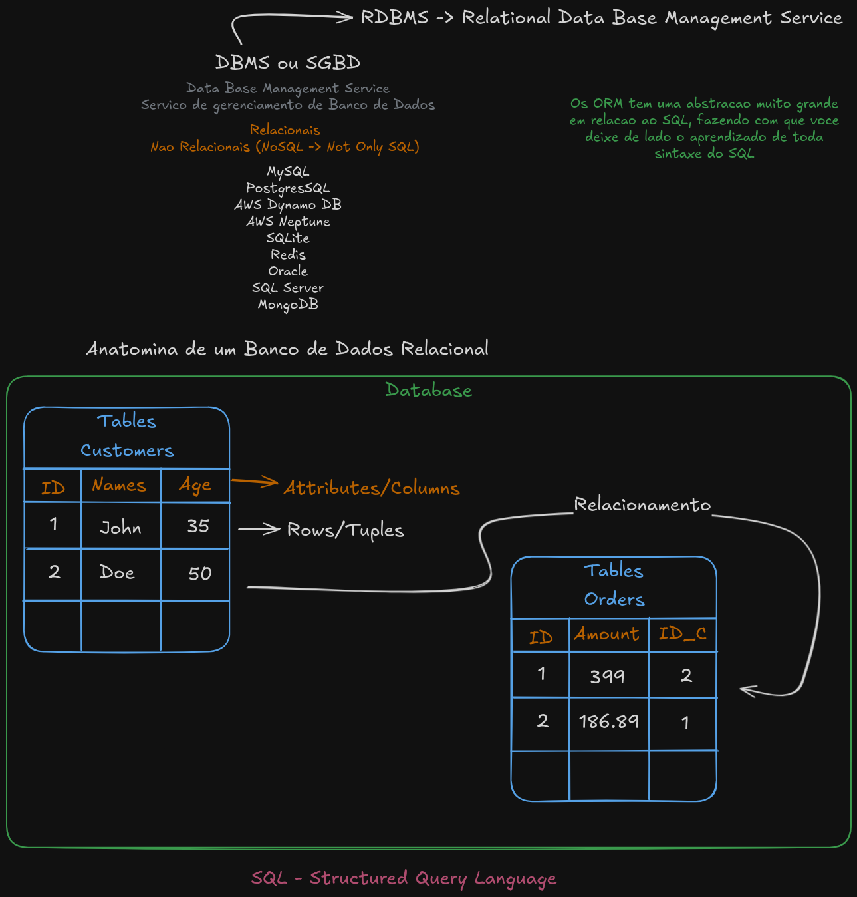

# 🛢️ Forget the ORMs, Let's Talk About SQL

 🧩 This project was developed as part of the **Forget the ORMs, Let's Talk About SQL** live from the [JStack](https://jstack.com.br/) course. The goal is to learn **SQL in practice, without relying on *ORMs* or *query builders***, by exploring the *SQL language* directly and running **PostgreSQL inside a Docker container using Docker Compose**.
 Throughout this project, we cover the fundamentals of databases, *SQL* commands, and containerization with Docker to set up an isolated environment for experimentation.
 
## 🎯 Objectives

 - Learn and practice the core **concepts of databases**
 - Understand and use **SQL commands** for creating and manipulating data
 - Set up **PostgreSQL in a Docker Compose container**
 - Sync local directories with containers for easier development
 - Perform CRUD operations *(Create, Read, Update, Delete)* directly in SQL
 - Explore filtering, ordering, and pagination with `WHERE`, `ORDER BY`, `LIMIT`, and `OFFSET`

## 📘 Explanation in Brazilian Portuguese (pt-BR)

The image below summarizes the keys concepts covered in the lesson about databases. All the content is explained in Brazilian Portuguese (pt-BR), making it easier to understand for native speakers.


## 📄 Technologies Used

 - **PostgreSQL**
 - **SQL**
 - **Docker**
 - **Docker Compose**

## ⚙️ Getting Started

### Prerequisites
Make sure you have the following installed:
 - **Node.js** (v18 or above)
 - **npm**, **Yarn** or **pnpm**
 - **Docker**

### Installation
Clone the repository:
```
git clone https://github.com/labs-jstack/023-forget-orm-lets-talk-about-sql.git
cd 023-forget-orm-lets-talk-about-sql
```

Start the containers (e.g., PostgreSQL) with Docker:
```
docker-compose up -d
```

Access the PostgreSQL container:
```
docker exec -it jstack-lives-sql bash
psql -U root
```

Now you can execute SQL commands directly in your PostgreSQL instance!

```
cd scripts
psql -f <file-name>
```

## Contributing
🤝 Feel free to open issues, suggest improvements or submit pull requests to help improve the project!

## License

📝 This project is licensed under the [MIT licensed](https://github.com/nestjs/nest/blob/master/LICENSE).

## Contact
✉️ Developed by João Henrique Fernandes.

[](https://www.linkedin.com/in/joaohenriquefernandes/)
[](https://github.com/joaohenriquefernandes)
